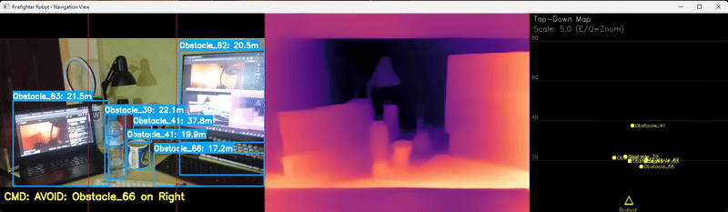

# `Firebot` Depth-Aware Firefighting Robot

This project implements an intelligent, depth-aware robotic system for autonomous firefighting. The system leverages a dual-YOLOv8 architecture for simultaneous fire and obstacle detection, a Vision Transformer (ViT) model for real-time depth perception, and a priority-based navigation algorithm to safely and effectively respond to fire incidents.

*Model demonstration:*




*Useful links:*

| Document         | Link                                                                                       |
| --------------------- | ----------------------------------------------------------------------------------------- |
| Proposal PKM-KC     | [PDF](./ets-eas_document/PKM-KC_Robot%20Pemadam%20Kebakaran%20BNU%20Gen%20II.pdf)                |
| Presentation Slide      | [PDF](./ets-eas_document/Slide_Robot%20Pemadam%20Kebakaran%20BNU%20Gen%20II.pdf)                  |
| Project Plan      | [PDF](./ets-eas_document/Planner_Robot%20Pemadam%20Kebakaran%20BNU%20Gen%20II.pdf)                  |
| Project Demo (video/image)      | [Google Drive](https://drive.google.com/drive/folders/1O5aWC1Q2IM5jjnCYymGzciidyFne0_Fe)                |

## Table of Contents

- [How It Works](#how-it-works)
- [System Architecture](#system-architecture)
- [Technology Stack](#technology-stack)
- [Directory Structure](#directory-structure)
- [Prerequisites](#prerequisites)
- [Setup Instructions](#setup-instructions)
- [Running the Project](#running-the-project)
- [Acknowledgments](#acknowledgments)

## How It Works

The robot's operation is a continuous loop of Perception, Decision-making, and Action. It processes video frames in real-time to understand its environment and make intelligent navigation choices.

1.  **Perception - Seeing the World:**
    *   The system captures a video frame.
    *   A **Depth Estimation Model** (`Intel/dpt-swinv2-tiny-256`) analyzes the frame to create a detailed depth map, calculating how far away every point in the scene is.
    *   Simultaneously, **two YOLOv8 models** run in parallel:
        *   **Fire/Smoke Model (`yolov8n-200e-v0.2.pt`):** A custom-trained model that specifically identifies fire and smoke.
        *   **Obstacle Model (`yolov8n.pt`):** A standard YOLOv8 model that detects general obstacles like people, furniture, etc.

2.  **Analysis - Understanding the Dangers:**
    *   The system combines the results from all three models. For every object detected (whether fire or obstacle), it uses the depth map to calculate its real-world distance from the robot.
    *   All detected objects are compiled into a single list, sorted by distance (closest first).

3.  **Decision - Choosing the Next Move:**
    *   A priority-based navigation algorithm analyzes the sorted list of objects to issue a command:
        *   **Priority 1 (Avoidance):** If the *closest* object is an obstacle and is within the `safe_distance_threshold`, the robot will turn left or right to avoid it.
        *   **Priority 2 (Targeting):** If there are no immediate obstacle threats, the robot will navigate towards the *closest* detected fire. It moves forward, left, or right to keep the fire centered in its view.
        *   **Priority 3 (Exploration):** If no fire is detected but the path ahead is clear of obstacles, the robot moves forward to search for threats.
        *   **Priority 4 (Halt):** If the path is blocked or a fire is too close, the robot stops to ensure safety.

4.  **Action & Monitoring - Executing the Command:**
    *   The chosen command (e.g., `forward`, `left`, `stop`) is sent to the **Firebase Realtime Database**.
    *   The physical robot (controlled by an Arduino or similar microcontroller) listens to this database path and executes the corresponding motor command.
    *   This entire process repeats, allowing for continuous, autonomous operation.

## System Architecture

The system is composed of three main modules:

1.  **Vision & Perception Module**
    *   **Dual YOLOv8 Engine:** For simultaneous fire, smoke, and obstacle detection.
    *   **Depth Estimation Engine:** Uses `Intel/dpt-swinv2-tiny-256` for dense depth mapping.
    *   **Data Fusion:** Combines detection boxes with depth data to locate objects in 3D space.

2.  **Navigation & Control Module**
    *   **Priority-Based Algorithm:** Determines the robot's next move based on a clear set of safety and mission rules.
    *   **Command Generation:** Translates the decision into a simple command code (0: stop, 1: forward, 2: left, 3: right).

3.  **Backend & Communication Module**
    *   **Firebase Realtime Database:** Acts as the communication bridge between the Python brain and the robot's hardware.
    *   **Remote Monitoring:** The system provides a real-time visual feed including the main camera view, a depth map visualization, and a top-down tactical map.

## Technology Stack

*   **Object Detection:** [Ultralytics YOLOv8](https://docs.ultralytics.com/)
    *   Used for real-time detection of fire, smoke, and obstacles using two parallel models.
*   **Depth Estimation:** [Hugging Face Transformers](https://huggingface.co/docs/transformers/index)
    *   Employs the `Intel/dpt-swinv2-tiny-256` model, a state-of-the-art Depth Prediction Transformer.
*   **Backend & Control:** [Firebase Realtime Database](https://firebase.google.com/docs/database)
    *   Provides a simple, low-latency channel for sending navigation commands to the robot hardware.

## Directory Structure

```
robotic-firebot/
├── python/
│   ├── navigate2depth.py    # Main application script
│   ├── config.yaml          # All configuration settings
│   ├── requirements.txt     # Python dependencies
│   ├── check_gpu.py         # Utility to verify CUDA setup
│   └── run_robot.bat        # Windows script for easy execution
│
├── checkpoints/             # Directory for model weights
│   ├── yolov8n.pt           # Standard obstacle detection model
│   └── yolov8n-200e-v0.2.pt # Custom fire/smoke detection model
│
├── arduino/                 # Arduino firmware for motor control
│   └── ...
│
├── ets-eas_document/        # Project proposal and presentation files
│   └── ...
│
├── ipynb/                   # Jupyter notebooks for experimentation
│   └── ...
│
├── serviceAccountKey.json   # Firebase service account key (place in root)
│
└── README.md                # This documentation file
```

## Prerequisites

*   Python 3.8+
*   Git
*   A Firebase project with Realtime Database enabled
*   (Recommended) An NVIDIA GPU with CUDA and cuDNN installed for real-time performance

## Setup Instructions

### 1. Clone the Repository

```bash
git clone https://github.com/kyrozepto/robotic-firebot
cd robotic-firebot
```

### 2. Set Up a Python Environment

It is highly recommended to use a virtual environment.

```bash
# Navigate into the python script directory
cd python

# Create and activate a virtual environment
python -m venv venv
# On Windows:
venv\Scripts\activate
# On macOS/Linux:
source venv/bin/activate

# Install the required packages
pip install -r requirements.txt
```

### 3. GPU Acceleration (Recommended)

For real-time performance, a CUDA-enabled GPU is essential.

1.  Install the [NVIDIA CUDA Toolkit](https://developer.nvidia.com/cuda-toolkit-archive) that matches your driver version.
2.  Install [cuDNN](https://developer.nvidia.com/cudnn).
3.  Install PyTorch with CUDA support. Check the [PyTorch website](https://pytorch.org/get-started/locally/) for the correct command for your specific CUDA version. For CUDA 11.8, the command is:
    ```bash
    pip install torch torchvision torchaudio --index-url https://download.pytorch.org/whl/cu118
    ```
4.  Verify the setup by running:
    ```bash
    python check_gpu.py
    ```

### 4. Download Models

Download the required YOLOv8 model weights and place them in the `checkpoints/` directory at the root of the project.

1.  `yolov8n.pt` (Standard model for obstacles)
2.  `yolov8n-200e-v0.2.pt` (Your custom model for fire/smoke)

Your `checkpoints` folder should look like this:
```
robotic-firebot/
└── checkpoints/
    ├── yolov8n.pt
    └── yolov8n-200e-v0.2.pt
```

### 5. Firebase Setup

1.  Go to the [Firebase Console](https://console.firebase.google.com/) and create a new project.
2.  In your project, go to **Build > Realtime Database**, click "Create database", and start in **test mode** (you can secure the rules later).
3.  In Project Settings (⚙️) > **Service Accounts**, click "Generate new private key".
4.  A JSON file will be downloaded. **Rename it to `serviceAccountKey.json` and place it in the root `robotic-firebot/` directory.**

### 6. Configuration

All settings are managed in the `python/config.yaml` file. Review it before running the script.

| Setting | Description |
| :--- | :--- |
| `gpu.enabled` | `1` to use GPU, `0` for CPU. |
| `yolo.obstacle_model_path` | Path to the standard YOLOv8 model for obstacle detection. |
| `yolo.fire_smoke_model_path`| Path to your custom YOLOv8 model for fire/smoke detection. |
| `yolo.model_confidence` | The minimum confidence score (0.0 to 1.0) to consider a detection valid. |
| `depth_model.name` | The Hugging Face name of the depth estimation model. |
| `depth_model.safe_distance_threshold` | The distance (in meters) at which the robot will prioritize obstacle avoidance. |
| `firebase.cred_path` | Path to your Firebase service account key. The default `../serviceAccountKey.json` is correct if you follow the setup steps. |
| `firebase.db_url` | The URL of your Firebase Realtime Database. |
| `firebase.command_path` | The specific path within the database where commands will be written. |
| `class_ids.fire` / `.smoke` | The class IDs for fire and smoke from your custom dataset. |
| `video_source` | `0` for the default webcam, or a path to a video file (e.g., `"path/to/video.mp4"`). |
| `map_view.enabled` | `1` to show the top-down map visualization, `0` to hide it. |

## Running the Project

Ensure you are in the `python/` directory and your virtual environment is activated.

#### On Windows (Easy Method)
Simply double-click or run the batch file:
```bash
run_robot.bat
```

#### On Any OS (Manual Method)
```bash
python navigate2depth.py
```

Press the `ESC` key in the display window to exit the program.

## Acknowledgments

* **Vision Transformers for Dense Prediction** by René Ranftl, Alexey Bochkovskiy, Vladlen Koltun, available at [https://arxiv.org/abs/2103.13413](https://arxiv.org/abs/2103.13413)
* [Ultralytics](https://github.com/ultralytics/ultralytics)
* [Hugging Face](https://huggingface.co/)
* [Google Firebase](https://firebase.google.com/)
* [PyTorch](https://pytorch.org/)
